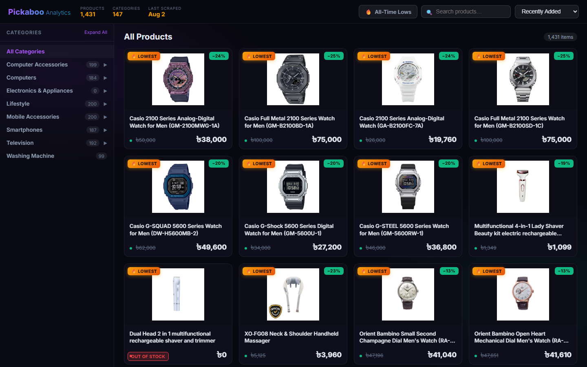
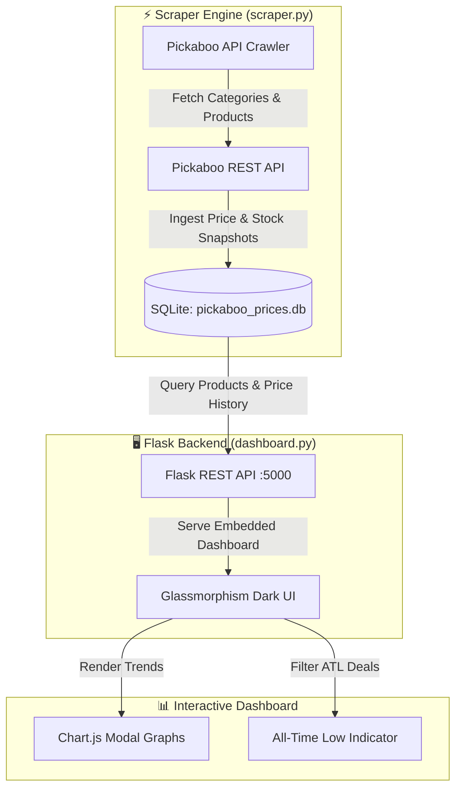

# 🛒 Pickaboo Price Tracker & Analytics Dashboard

> **Gadget & Electronics Price History Tracking, Discount Telemetry & All-Time Low (ATL) Detection Engine for Pickaboo.**

[](https://ranehal.github.io/PICAboo-analytics/)
[](https://www.python.org/)
[](https://flask.palletsprojects.com/)
[](https://www.sqlite.org/)
[](LICENSE)

---

## 📌 Executive Summary

**PICAboo Analytics** is an end-to-end gadget price tracker and deal discovery platform for [Pickaboo](https://www.pickaboo.com), one of Bangladesh's leading electronics and smartphone e-commerce stores.

The platform continuously crawls Pickaboo's catalog APIs, tracks historical price snapshots, measures discount percentages, detects **All-Time Low (ATL)** price drops, and visualizes price trends via a modern Flask-powered Glassmorphism dark-mode dashboard.

---

## 🚀 Key Features

- **🔍 Automated Category Crawler**: Recursively discovers categories and paginates through Pickaboo product catalogs.
- **🏷️ All-Time Low (ATL) Detection**: Highlights products currently sitting at their lowest historical recorded price.
- **📉 Price Trend Analytics (Chart.js)**: Interactive historical price modals displaying fluctuations, special offer pricing, and stock availability.
- **🎨 Glassmorphism Dark-Mode UI**: Sleek translucent dark interface with instant search, category filtering, and responsive grid layouts.
- **⚡ Batch Launcher (`runall.bat`)**: Zero-configuration Windows launcher script for automated scraping and web server execution.

---

## 📸 Screenshots



---

## 🏗️ System Architecture



---

## 📁 Repository Structure

```
PICAboo/
├── scraper.py           # Pickaboo catalog crawler & price snapshot ingestion script
├── dashboard.py         # Flask web server & embedded single-page interactive application
├── pickaboo_prices.db   # SQLite database storing categories, products, and price history
├── runall.bat           # Interactive Windows batch launcher
├── requirements.txt     # Python dependencies (Flask, requests)
└── README.md            # Technical documentation
```

---

## 🛠️ Database Schema (`pickaboo_prices.db`)

- **`categories`**: `(id, name, slug, parent_id)`
- **`products`**: `(id, sku, name, slug, category_id, category_name, product_img, unit, unit_value)`
- **`price_history`**: `(id, product_id, price, special_price, discount, stock_available, scraped_at)`

---

## ⚡ Quick Start & Usage

### 1. Interactive Windows Launcher
Double-click or run [`runall.bat`](file:///C:/PROJECTS/PICAboo/runall.bat):
```cmd
runall.bat
```
Select:
1. Scrape live prices across all categories.
2. Scrape specific category IDs.
3. Launch dashboard server only (`http://localhost:5000`).
4. Scrape live prices and launch dashboard concurrently.

### 2. Manual CLI Execution
```bash
# Install dependencies
pip install -r requirements.txt

# Run scraper CLI
python scraper.py --delay 0.6

# Launch Flask web dashboard
python dashboard.py
```
Open `http://localhost:5000` in your web browser.

---

## 📜 License

Distributed under the MIT License. Data rights belong to Pickaboo. Built for analytical and personal price tracking purposes.

---

## 🚀 Future Work & Industrial Roadmap

To elevate this platform to an enterprise-grade, production-ready product meeting current industrial standards, the following strategic goals and architecture enhancements are planned:

### 1. 🏗️ High-Availability Microservices & Infrastructure
- **Containerization & Orchestration**: Package ingestion workers, APIs, and dashboards into Docker containers with deployment via **Kubernetes (K8s)** and Helm charts for autoscaling during peak traffic hours.
- **Distributed Ingestion Workers**: Transition from localized scraping scripts to an asynchronous, fault-tolerant worker pool utilizing **Celery + Redis** or **Temporal.io** with automated proxy rotation, rate-limiting retry strategies, and CAPTCHA bypass capabilities.
- **High-Performance API Gateway**: Implement an enterprise API Gateway (Kong / Envoy) providing OAuth2 / JWT authentication, TLS termination, and granular rate limiting (Token Bucket algorithm).

### 2. 📊 Enterprise Data Engineering & Streaming Pipelines
- **Data Lakehouse Architecture**: Store multi-year raw price histories using **Apache Parquet / Delta Lake** or **Google BigQuery** for scalable analytical queries across millions of SKU updates.
- **Real-Time CDC & Message Streaming**: Integrate **Apache Kafka** or **NATS** for Change Data Capture (CDC) to stream price change events instantly to downstream analytics and notification consumers.
- **Automated Workflow Orchestration**: Schedule and monitor data ingestion, ETL pipelines, and unit normalization using **Apache Airflow** or **Prefect** integrated with **dbt** for dynamic data transformations.

### 3. 🧠 Machine Learning & Advanced Market Intelligence
- **Predictive Price Forecasting**: Deploy **Prophet** and **LSTM Neural Networks** to predict future price drops, historical promotion trends, and seasonal discount cycles.
- **Anomaly & Surge Detection**: Build ML models to identify artificial price hikes before promotional sales, mislabeled unit metrics, and phantom stock availability.
- **Semantic Product Entity Matching**: Utilize vector embeddings (OpenAI / Sentence-Transformers) paired with **pgvector** / **Pinecone** to match identical SKUs across competitor platforms despite variations in naming formats.

### 4. 🔐 Security, Compliance & System Observability
- **Zero-Trust Security & RBAC**: Enforce Role-Based Access Control (RBAC), AES-256 GCM payload encryption at rest, and secret rotation via HashiCorp Vault.
- **Full Observability Stack**: Instrument services with **OpenTelemetry**, emitting distributed traces, Prometheus metrics, and structured logs to **Grafana Loki & Tempo** dashboards.
- **SLA Alerting & Webhook Engine**: Provide instant trigger notifications via **Telegram Bot API**, **Discord Webhooks**, email notifications, and enterprise SMS gateways when watched items reach target prices.

### 5. 📱 Next-Gen User Experience & Mobile Platforms
- **Cross-Platform Mobile App**: Develop a dedicated **React Native / Flutter** app featuring push notifications for price drops, barcode scanning in physical stores, and personalized deal watchlists.
- **Progressive Web App (PWA)**: Upgrade the dashboard to a full PWA with offline caching via Service Workers, dynamic theme switching, and desktop application installability.
